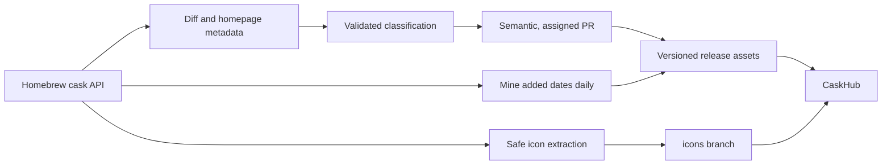

# CaskFlow

[](https://github.com/alielsokary/CaskFlow/actions/workflows/tests.yml)
[](https://app.codacy.com/gh/alielsokary/CaskFlow/dashboard)
[](https://codecov.io/gh/alielsokary/CaskFlow)
[](https://github.com/alielsokary/CaskFlow/releases/latest)
[](LICENSE)


CaskFlow convierte el catálogo activo de casks de Homebrew en metadatos revisados y listos para publicación para [CaskHub](https://github.com/alielsokary/CaskHub). Clasifica aplicaciones, rastrea cuándo se agregaron los casks, extrae iconos de proveedores de forma segura y publica activos con versión que CaskHub puede consumir con una alternativa integrada.

## Qué publica CaskFlow

| Activo | Propósito | Origen |
|---|---|---|
| `categories.json` | Mapeo canónico de cask a categoría, taxonomía, etiqueta de versión y manifiesto de iconos opcional | Repositorio y [última versión](https://github.com/alielsokary/CaskFlow/releases/latest) |
| `added_dates.json` | Fecha de adición más temprana conocida en Homebrew para cada cask | Generado para cada versión |
| `<token>.png` | Iconos de aplicaciones de 256×256 | Rama huérfana [`icons`](https://github.com/alielsokary/CaskFlow/tree/icons) |

La taxonomía cuenta con 17 categorías principales y un rasgo `ai` exclusivo de categoría secundaria. Cada cask tiene exactamente una categoría principal y hasta dos categorías secundarias distintas. Consulta la [guía de clasificación](docs/CLASSIFICATION_GUIDE.md) para conocer los límites de las categorías y las reglas de revisión.

## Cómo funciona



El flujo de trabajo diario de clasificación agrega nuevos casks, migra los cambios de nombre de tokens de Homebrew y elimina entradas eliminadas o deshabilitadas. Los fallos del proveedor y de validación se omiten para reintento posterior. Los resultados con una confianza inferior a `0.75` permanecen en una PR asignada para revisión manual; las actualizaciones con mayor confianza pueden fusionarse automáticamente una vez superadas las comprobaciones obligatorias.

El flujo de trabajo de publicación se ejecuta diariamente de forma independiente a la clasificación, marca `categories.json` con su etiqueta de versión y el manifiesto actual de iconos-tokens cuando está disponible, y extrae `added_dates.json` directamente del historial de Homebrew. Antes de publicar, verifica que cada cask en el árbol actual del tap tenga una fecha de adición. Una fusión de categorías también lo activa de inmediato. Por lo tanto, las actualizaciones de clasificación no retrasan los datos de Recién Agregados, y las actualizaciones de fechas no requieren un resultado de LLM ni una asignación de categoría.

Los iconos se descargan desde los artefactos del proveedor, se verifican con suma de comprobación, se extraen sin ejecutar scripts de instalación y se convierten desde el archivo `.icns` del paquete de la aplicación. El protocolo completo de seguridad y auditoría se encuentra en [Extracción de iconos](docs/ICON_EXTRACTION.md).

## Desarrollo local

Se recomienda Python 3.12 o una versión posterior.

```bash
python3 -m venv .venv
source .venv/bin/activate
pip install -r requirements.txt

# Deterministic preview; repository files remain unchanged.
LLM_PROVIDER=mock python scripts/classify_new_casks.py --dry-run

# Test suite and coverage report.
pytest --cov=scripts --cov-report=term-missing
```

La clasificación real admite `anthropic`, `openai`, `groq` y `cloudflare`; elige uno con `LLM_PROVIDER` y proporciona las credenciales de ese servicio. `mock` está destinado a la verificación local determinista.

## Guía del repositorio

- [`scripts/`](scripts) contiene las herramientas de clasificación, corrección, datos de publicación e iconos que se mantienen activamente.
- [`tests/`](tests) cubre las reglas de esquema y el comportamiento de mayor riesgo en la canalización.
- [`data/`](data) almacena informes generados, cachés y entradas de corrección revisadas; no es la fuente canónica de categorías.
- [`.github/workflows/`](.github/workflows) contiene la automatización para clasificación, iconos, publicación y verificación.

## Proyectos que usan CaskFlow

| Proyecto | Descripción | Categorías | Fechas&nbsp;de&nbsp;adición | Iconos |
|---|---|:---:|:---:|:---:|
| [CaskHub](https://github.com/alielsokary/CaskHub) | Aplicación nativa para macOS para descubrir, instalar y administrar casks de Homebrew | ✅ | ✅ | ✅ |
| [Applite](https://github.com/milanvarady/Applite) | Aplicación macOS con interfaz gráfica y fácil de usar para casks de Homebrew | - | - | ✅ |
| [*Añade&nbsp;el&nbsp;tuyo*](https://github.com/alielsokary/CaskFlow/edit/develop/README.md) | ¿Usas datos de CaskFlow en tu proyecto? Añádelo a esta tabla | - | - | - |

## Atribución

CaskFlow tiene [licencia MIT](LICENSE), por lo que no se requiere ninguna atribución más allá de lo establecido en los términos de la licencia. Si tu proyecto consume datos de CaskFlow (categorías, fechas de adición o iconos), se agradecerá mucho un crédito visible con un enlace de vuelta, por ejemplo:

> Metadatos de casks impulsados por [CaskFlow](https://github.com/alielsokary/CaskFlow)

## Contribución

Son bienvenidos los informes de errores, correcciones taxonómicas, pruebas, mejoras en la documentación y el endurecimiento de la canalización. Comienza con [CONTRIBUTING.md](CONTRIBUTING.md), donde se explica la verificación local, la evidencia para correcciones de categorías y el formato de título semántico requerido para las PR. Los pull requests deben dirigirse a la rama `develop`.

## Licencia

[MIT](LICENSE)
