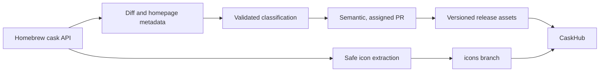

# CaskFlow

[](https://github.com/alielsokary/CaskFlow/actions/workflows/tests.yml)
[](https://app.codacy.com/gh/alielsokary/CaskFlow/dashboard)
[](https://codecov.io/gh/alielsokary/CaskFlow)
[](https://github.com/alielsokary/CaskFlow/releases/latest)
[](LICENSE)


CaskFlow turns the live Homebrew cask catalog into reviewed, release-ready metadata for [CaskHub](https://github.com/alielsokary/CaskHub). It classifies applications, tracks when casks were added, extracts vendor icons safely, and publishes versioned assets that CaskHub can consume with a bundled fallback.

## What CaskFlow publishes

| Asset | Purpose | Source |
|---|---|---|
| `categories.json` | Canonical cask-to-category mapping, taxonomy, release tag, and optional icon manifest | Repository and [latest release](https://github.com/alielsokary/CaskFlow/releases/latest) |
| `added_dates.json` | Earliest known Homebrew addition date for each cask | Generated for each release |
| `<token>.png` | 256×256 application icons | Orphan [`icons` branch](https://github.com/alielsokary/CaskFlow/tree/icons) |

The taxonomy has 17 primary categories and one secondary-only `ai` trait. Each cask has exactly one primary category and up to two distinct secondary categories. See the [classification guide](docs/CLASSIFICATION_GUIDE.md) for category boundaries and review rules.

## How it works



The daily classification workflow adds new casks, migrates Homebrew token renames, and prunes removed or disabled entries. Provider and validation failures are skipped for a later retry. Results below `0.75` confidence remain in an assigned PR for manual review; higher-confidence updates may auto-merge after required checks pass.

The release workflow stamps `categories.json` with its release tag and, when available, the current icon-token manifest. It also mines `added_dates.json` from Homebrew’s history. CaskHub refreshes these assets remotely and falls back to its bundled copies when needed.

Icons are downloaded from vendor artifacts, checksum-verified, expanded without running installer scripts, and converted from the application bundle’s `.icns` file. The full safety and audit protocol is in [Icon Extraction](docs/ICON_EXTRACTION.md).

## Local development

Python 3.12 or newer is recommended.

```bash
python3 -m venv .venv
source .venv/bin/activate
pip install -r requirements.txt

# Deterministic preview; repository files remain unchanged.
LLM_PROVIDER=mock python scripts/classify_new_casks.py --dry-run

# Test suite and coverage report.
pytest --cov=scripts --cov-report=term-missing
```

Real classification supports `anthropic`, `openai`, `groq`, and `cloudflare`; choose one with `LLM_PROVIDER` and provide that service’s credentials. `mock` is intended for deterministic local verification.

## Repository guide

- [`scripts/`](scripts) contains the maintained classification, correction, release-data, and icon tooling.
- [`tests/`](tests) covers schema rules and the highest-risk pipeline behavior.
- [`data/`](data) holds generated reports, caches, and reviewed correction input; it is not the canonical category source.
- [`.github/workflows/`](.github/workflows) contains classification, icon, release, and verification automation.

## Contributing

Bug reports, taxonomy corrections, tests, documentation improvements, and pipeline hardening are welcome. Start with [CONTRIBUTING.md](CONTRIBUTING.md), which explains local verification, category correction evidence, and the required semantic PR title format.

Examples: `fix(classifier): Handle malformed output`, `docs: Clarify category boundaries`, or `chore: Daily cask classification update`.

## License

[MIT](LICENSE)
